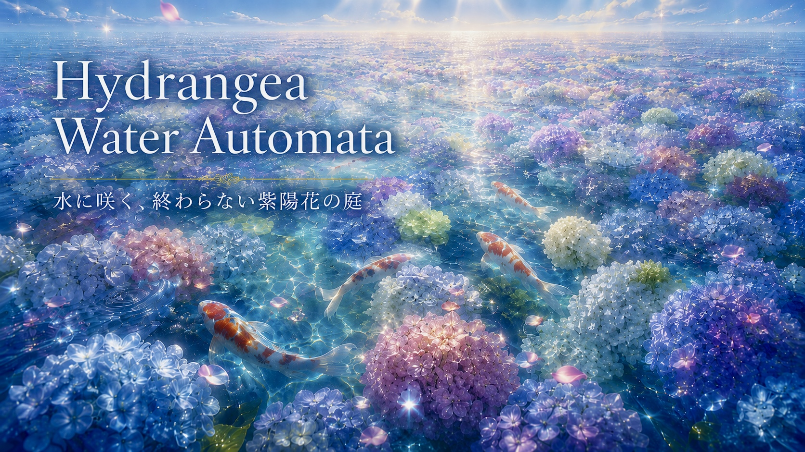

# Hydrangea Water Automata 🌸🐟



A living generative artwork: endless hydrangea fields under glass-like water, sunlight reflections, and koi fish swimming gracefully.

## Concept

This project treats the canvas as a living field. Each cell stores color, water, bloom energy, and hidden neural states. Local neural rules create hydrangea-like structures, ripples, mist, and liquid light.

## Steps / Stages
(to be released soon...)


## Gallery

*Neural CA growth animation.* (to be released soon...)

*Koi swimming layer.* (to be released soon...)

*Final artistic vision.* (to be released soon...)

## Run Locally

```bash
git clone https://github.com/ChenCheng-976/hydrangea-water-automata.git
cd YOUR_REPO
python3 -m venv .venv
source .venv/bin/activate
pip install -r requirements.txt
python stage10_koi_fish_layer.py
